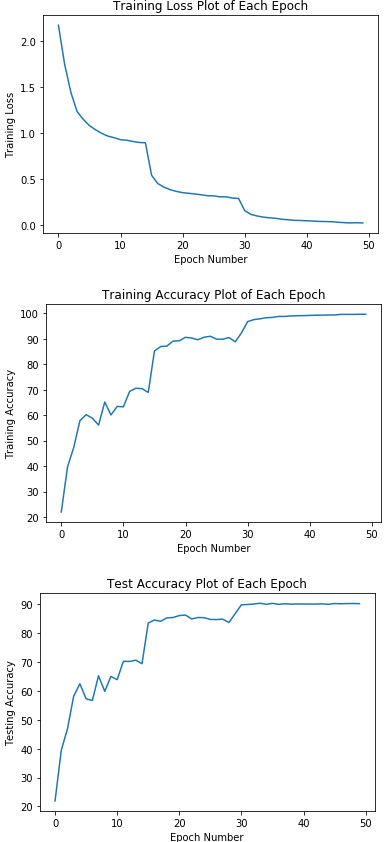

# Project-VGG
Implementation of VGG, with different configuration: VGG11, VGG13, VGG16, VGG19, trained and tested on CIFAR 10 dataset.

Paper: Very Deep Convolutional Networks For Large-scale Image Recognition

Architecture:

In my code, Config A is VGG11, Config B is VGG13, Config D is VGG16, Config E is VGG19

Input: 32 x 32 RGB image.

Conv. Layer: 3 x 3, stride = 1, padding = 1

Max-Pooling: 2 x 2, stride = 2

Fully Connected Layers: This part is different from the paper. In the paper, they used 4096, 4096, 1000. I used 512, 10. Because the input size is different, and the original structure can overfit too much on this relatively small dataset and the training time is much shorter with this smaller network.

Final Layer: Softmax

All hidden conv layers are equipped with ReLU non-linearity.

I trained and tested this network on CIFAR 10 dataset. And I did following data augmentation: random rotation, random horizontal flip. And I normalized the data by the mean and standard deviation. I used SGD as optimizer and the learning rate is 0.1 initially, and decreases by 2 times every 15 epochs.

These are graphs of the Training Loss, Training Accuracy and Testing Accuracy.

The final accuracy with above parameters is: 90.34%

Note that this is not fully tuned and optimized, you can try more parameters to get better result.