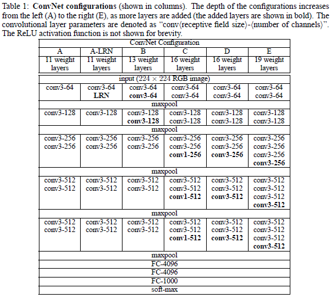

# Project-VGG
Implementation of VGG, with different configuration: VGG11, VGG13, VGG16, VGG19

Paper: Very Deep Convolutional Networks For Large-scale Image Recognition

Architecture:

    Input: 224 x 224 RGB image.
    Conv. Layer: 3 x 3, stride = 1, padding = 1.
    Max-Pooling: 2 x 2, stride = 2
    Fully Connected Layers: 4096, 4096, num_classes
    Final Layer: Softmax
    All hidden layers are equipped with ReLU non-linearity.